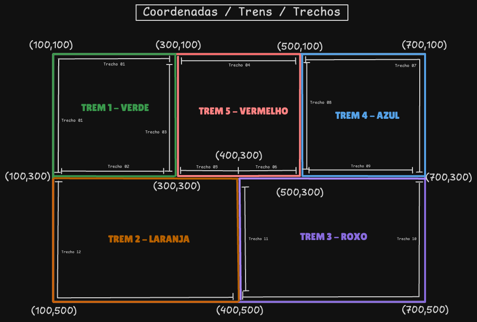

# 🚆 Projeto dos Trens – Sistemas Operacionais (IMD0036)

## 📘 Sobre o Trabalho
Este projeto faz parte da disciplina **Sistemas Operacionais** do **Instituto Metrópole Digital (IMD/UFRN)** e tem como objetivo aplicar conceitos de **concorrência e sincronização de threads** em C++.  

O desafio consiste em desenvolver uma **simulação de uma malha ferroviária** onde **múltiplos trens** circulam simultaneamente em trilhos compartilhados, **evitando colisões e deadlocks** por meio do uso de **mutexes** ou **semáforos**.

---

## 🚉 Descrição do Projeto

O sistema simula **6 trens** independentes:
- 5 trens (verde, vermelho, azul, laranja e roxo) percorrem **malhas internas** no sentido **horário**;
- 1 trem (preto) percorre a **malha externa** no sentido **anti-horário**.

Cada trem é executado em uma **thread própria**, garantindo **máximo paralelismo** e **assincronismo** entre as execuções.

O projeto define **7 regiões críticas** (zonas de conflito) — locais onde dois ou mais trens podem colidir.  
Essas regiões são controladas por **mutexes** ou **semáforos**, garantindo o acesso exclusivo e evitando condições de corrida.

A figura abaixo ilustra a **malha ferroviária** utilizada no projeto, com os respectivos trechos e zonas de conflito:

---

## ⚙️ Tecnologias e Conceitos Utilizados

- **Linguagem:** C++
- **Framework gráfico:** Qt
- **Programação concorrente:** Threads (`std::thread`)
- **Controle de acesso:** Mutexes e/ou Semáforos
- **Conceitos principais:**
  - Regiões críticas
  - Exclusão mútua
  - Deadlocks e livelocks
  - Sincronização de processos concorrentes

---

## 🧠 Funcionamento

- Cada trem possui uma **velocidade individual**, ajustável por meio de um **QSlider** (controle deslizante).
- O controle vai de **0 (trem parado)** a **200 (velocidade máxima)**.
- Os trens iniciam o movimento automaticamente ao abrir o programa.
- O sistema deve:
  - Evitar colisões entre trens;
  - Minimizar situações de travamento (deadlocks);
  - Permitir movimento contínuo e fluido das locomotivas.

---

## 🧩 Etapas do Desenvolvimento

1. Implementar as **6 threads** (uma por trem);
2. Definir as **7 regiões críticas** da malha ferroviária;
3. Implementar **mutexes** ou **semáforos** para controlar as zonas de conflito;
4. Garantir movimentação contínua e segura;
5. Após o funcionamento estável, **adicionar mais trens** para aumentar a complexidade e testar a robustez da solução.

---

## 👥 Desenvolvedores

Este projeto está sendo desenvolvido por:  
- **[Artur Rochel](https://www.linkedin.com/in/artur-rochel-950361184/)**  
- **[José Gildenilson](https://www.linkedin.com/in/josegildenilson/)**  

Alunos do **Instituto Metrópole Digital – UFRN**, na disciplina **Sistemas Operacionais (IMD0036)**.

---

## 🧾 Licença
Este projeto é de caráter **acadêmico** e foi desenvolvido exclusivamente para fins de estudo na disciplina **Sistemas Operacionais**.